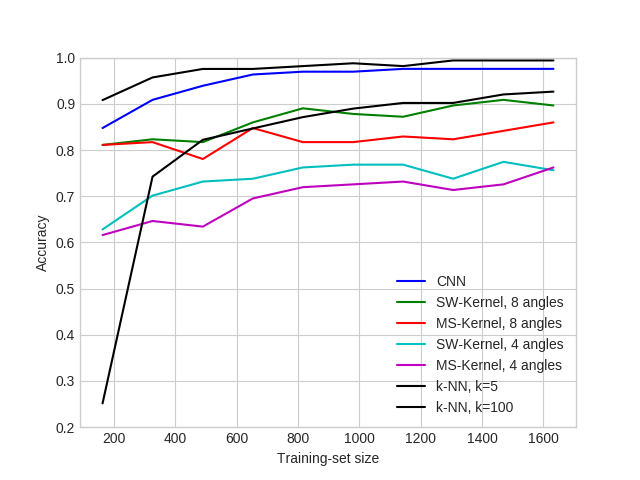

# TDA-ML_Analysis

Analyze and solve a classification problem using Toplogical Data Analysis as a Machine Learning approach.

## Main Objectives

Compare two well known ML approaches with two different multi-scale kernels for persistence diagrams.  
Analyse and apply these methods on a handwritten data-set.

## External dependencies & Usage
We used the pershombox package, which is dependent on some third party software tools which we do not provide here.
For more information we refer to https://github.com/c-hofer/tda-toolkit

Some other python packages required are:
- numpy
- scipy
- scikit-image 
- pandas

## Results

